# Arquitectura del Proyecto

## Descripción General

Este documento describe la arquitectura técnica de **El Túnel del Cómic**, una aplicación de e-commerce desarrollada con Laravel 13.

---

## Stack Tecnológico

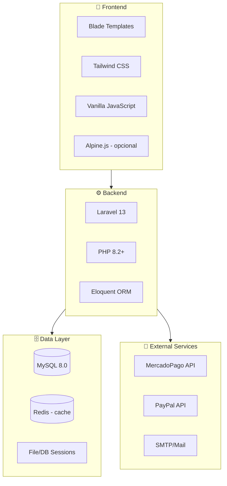

---

## Patrón MVC en Laravel

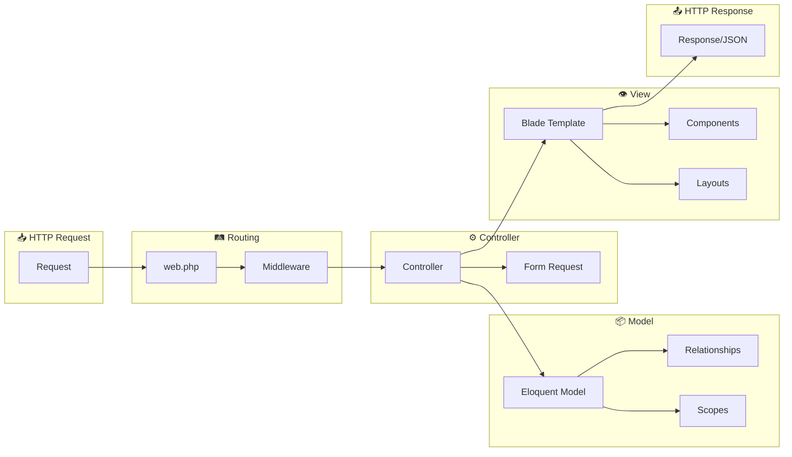

---

## Estructura de Directorios

```
el-tunel-del-comic-laravel/
├── app/
│   ├── Http/
│   │   ├── Controllers/
│   │   │   ├── Admin/
│   │   │   │   ├── ComicController.php
│   │   │   │   └── OrderController.php
│   │   │   ├── CartController.php
│   │   │   ├── CatalogController.php
│   │   │   ├── CheckoutController.php
│   │   │   ├── HomeController.php
│   │   │   ├── LanguageController.php
│   │   │   └── WebhookController.php
│   │   ├── Middleware/
│   │   │   ├── AdminMiddleware.php
│   │   │   └── SetLocale.php
│   │   └── Requests/
│   │       └── CheckoutRequest.php
│   ├── Models/
│   │   ├── Category.php
│   │   ├── Comic.php
│   │   ├── Order.php
│   │   ├── OrderItem.php
│   │   ├── Publisher.php
│   │   └── User.php
│   └── Services/
│       ├── MercadoPagoService.php
│       └── PayPalService.php
├── bootstrap/
│   └── app.php                    # Middleware config
├── config/
│   ├── app.php
│   ├── database.php
│   └── services.php               # MercadoPago + PayPal config
├── database/
│   ├── factories/
│   ├── migrations/
│   └── seeders/
│       ├── AdminUserSeeder.php
│       ├── CategorySeeder.php
│       ├── ComicSeeder.php
│       └── PublisherSeeder.php
├── docs/
│   ├── README.md
│   ├── ARQUITECTURA.md
│   ├── GUIA_RAPIDA.md
│   └── API.md
├── lang/
│   ├── en/messages.php
│   ├── es/messages.php
│   └── ko/messages.php
├── public/
│   └── storage/                   # Symlink to storage
├── resources/
│   └── views/
│       ├── admin/
│       │   ├── comics/
│       │   └── orders/
│       ├── auth/
│       ├── cart/
│       ├── catalog/
│       ├── checkout/
│       ├── home/
│       └── layouts/
│           ├── app.blade.php
│           ├── navbar.blade.php
│           └── footer.blade.php
├── routes/
│   ├── auth.php
│   └── web.php
├── storage/
│   └── app/public/comics/
├── tests/
│   ├── Feature/
│   └── Unit/
└── .env
```

---

## Modelos y Relaciones

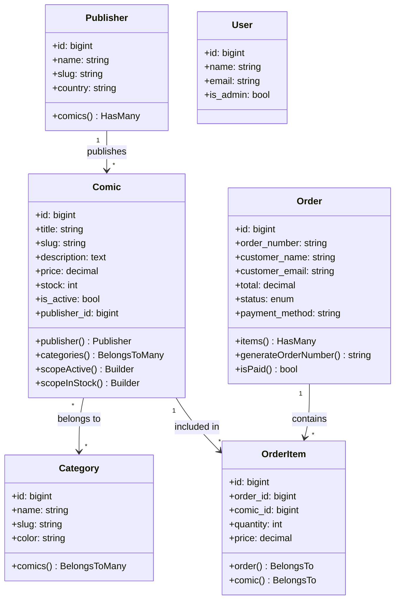

---

## Flujo de Datos

### Flujo de Compra

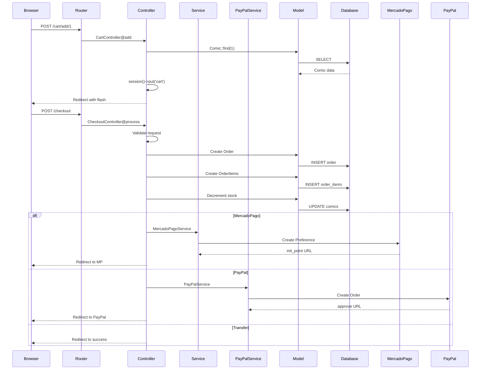

### Flujo de Autenticación

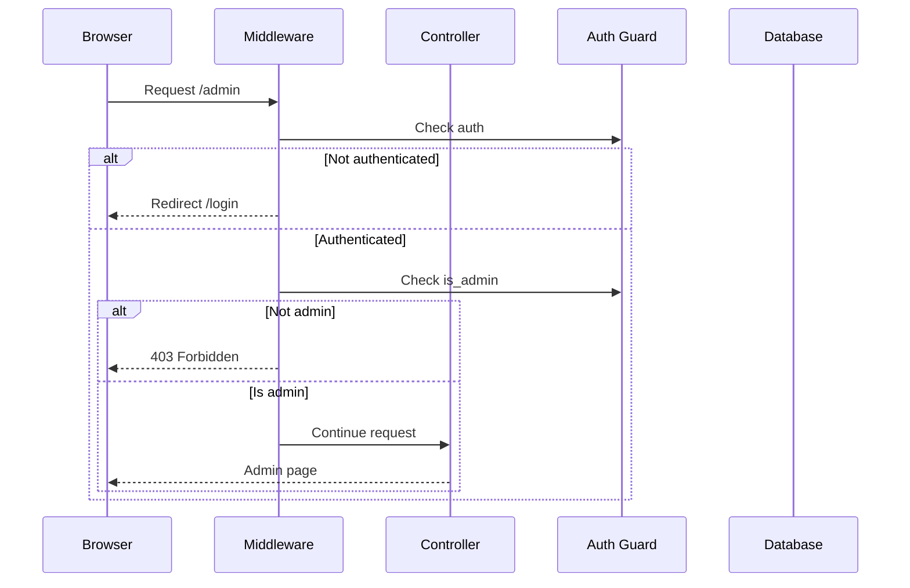

---

## Middleware Stack

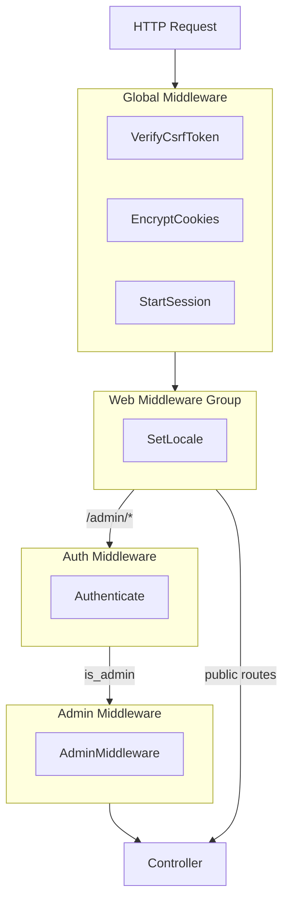

---

## Servicios Externos

### MercadoPago Integration

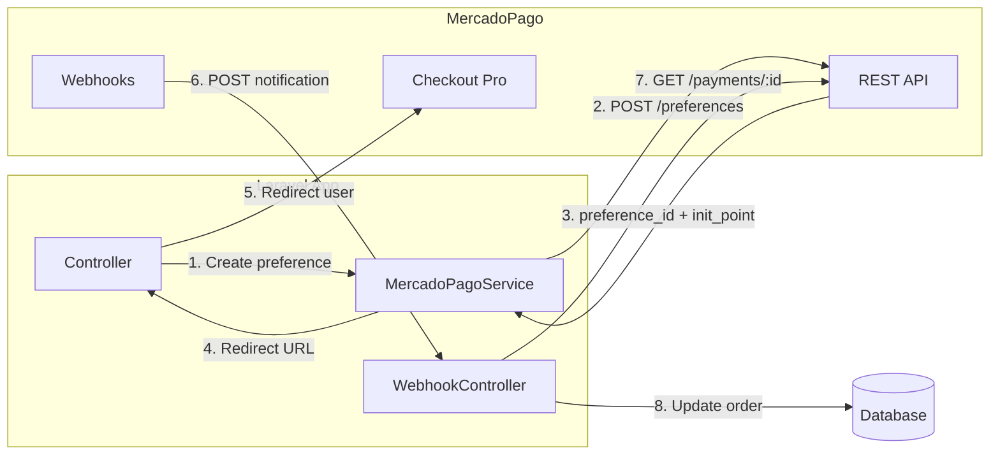

---

## Configuración de Caché

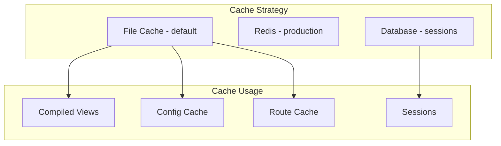

---

## Testing Strategy

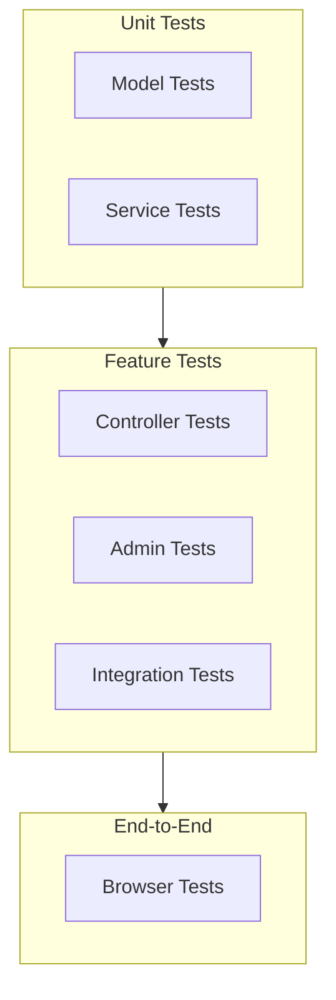

### Cobertura de Tests

| Tipo | Archivo | Cobertura |
|------|---------|-----------|
| Unit | ComicTest.php | Modelo Comic |
| Unit | OrderTest.php | Modelo Order |
| Unit | MercadoPagoServiceTest.php | Servicio MP |
| Feature | CatalogTest.php | Catálogo |
| Feature | CartTest.php | Carrito |
| Feature | CheckoutTest.php | Checkout |
| Feature | AdminTest.php | Panel Admin |

---

## Despliegue

### Requisitos de Servidor

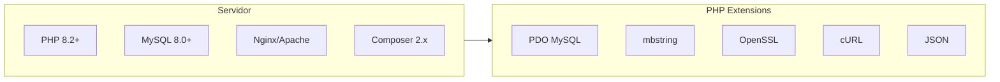

### Checklist de Producción

- [ ] `APP_ENV=production`
- [ ] `APP_DEBUG=false`
- [ ] `php artisan config:cache`
- [ ] `php artisan route:cache`
- [ ] `php artisan view:cache`
- [ ] Configurar SSL/HTTPS
- [ ] Configurar MercadoPago producción
- [ ] Configurar backups de DB
- [ ] Configurar logs

---

## Seguridad

### Medidas Implementadas

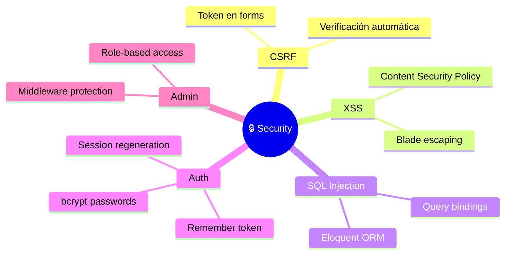

---

## Escalabilidad

### Consideraciones Futuras

1. **Horizontal Scaling**
   - Load balancer
   - Session storage en Redis
   - File storage en S3

2. **Optimización**
   - Query caching
   - Eager loading
   - Database indexing

3. **Queue System**
   - Laravel Queues para emails
   - Procesamiento de webhooks

---

*Documentación de arquitectura - El Túnel del Cómic v1.0*
