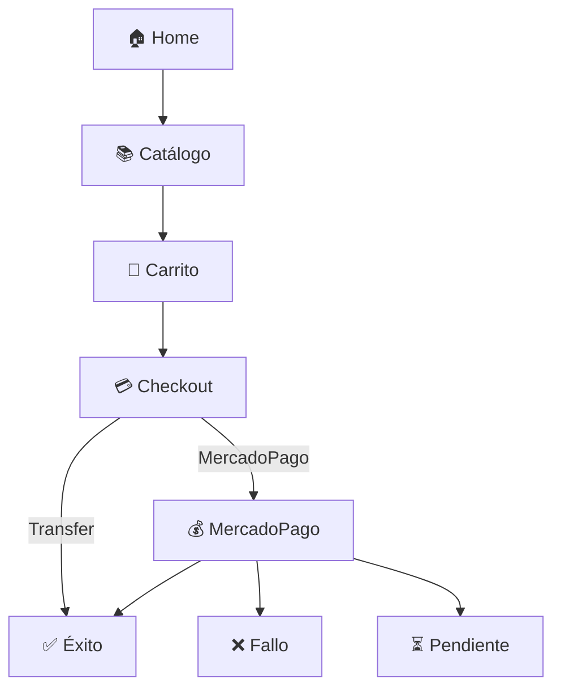
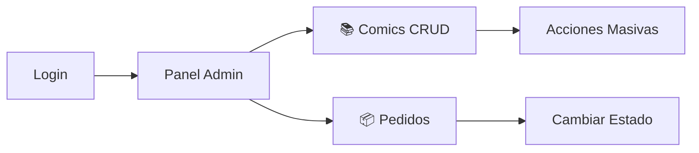
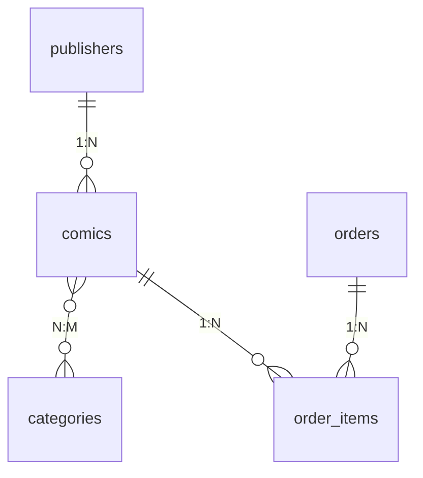

# Guía Rápida - El Túnel del Cómic

## 🚀 Iniciar el servidor

```bash
cd el-tunel-del-comic-laravel
php artisan serve --port=8080
```

**URL**: http://127.0.0.1:8080

---

## 🔑 Credenciales Admin

| Rol | Email | Password |
|-----|-------|----------|
| Admin | admin@eltuneldelcomic.com | admin123 |

---

## 📊 Flujo Principal



---

## 🔐 Panel Admin



**Acciones masivas:**
- ✅ Activar / ❌ Desactivar
- 📦 +5 Stock
- 💰 ±10% Precio

---

## 🛠️ Comandos Útiles

```bash
# Servidor
php artisan serve --port=8080

# Migraciones
php artisan migrate
php artisan migrate:fresh --seed

# Caché
php artisan cache:clear
php artisan view:clear
php artisan config:clear

# Tests
php artisan test
php artisan test --filter=CartTest

# Ver rutas
php artisan route:list
```

---

## 🌐 Multilenguaje

| Idioma | Bandera | Código |
|--------|---------|--------|
| Español | 🇪🇸 | es |
| English | 🇺🇸 | en |
| 한국어 | 🇰🇷 | ko |

**Cambiar:** Click en bandera del navbar

---

## 💳 MercadoPago

Configurar en `.env`:

```env
MERCADOPAGO_PUBLIC_KEY=APP_USR-xxxx
MERCADOPAGO_ACCESS_TOKEN=APP_USR-xxxx
```

---

## 🗄️ Base de Datos

```
Host: 127.0.0.1
DB: el_tunel_del_comic
User: root
Pass: Nienpedo01
```

**Estructura:**



---

## 🧪 Tests

```bash
# Unit Tests
php artisan test tests/Unit/ComicTest.php
php artisan test tests/Unit/OrderTest.php
php artisan test tests/Unit/MercadoPagoServiceTest.php

# Feature Tests
php artisan test tests/Feature/CatalogTest.php
php artisan test tests/Feature/CartTest.php
php artisan test tests/Feature/CheckoutTest.php
php artisan test tests/Feature/AdminTest.php
```

---

## 📁 Archivos Clave

| Archivo | Descripción |
|---------|-------------|
| `routes/web.php` | Todas las rutas |
| `app/Services/MercadoPagoService.php` | Integración MP |
| `app/Http/Middleware/AdminMiddleware.php` | Protección admin |
| `app/Http/Middleware/SetLocale.php` | Multilenguaje |
| `lang/*/messages.php` | Traducciones |

---

## 📧 Soporte

- **Email:** soporte@eltuneldelcomic.com
- **WhatsApp:** +54 9 11 0000-0000

---

*Guía Rápida v1.0*
