# El Túnel del Cómic - Documentación Técnica

> 🎨 **Tienda online de cómics y manga** con diseño industrial/manga-style  
> 🛠️ **Stack:** Laravel 13 + MySQL + Tailwind CSS + MercadoPago + PayPal

---

## Índice

1. [Vista General](#vista-general)
2. [Arquitectura del Sistema](#arquitectura-del-sistema)
3. [Modelo de Base de Datos](#modelo-de-base-de-datos)
4. [Diseño Visual Original](#diseño-visual-original)
5. [Flujos de Usuario](#flujos-de-usuario)
6. [API de Pagos](#api-de-pagos)
7. [Multilenguaje](#multilenguaje)
8. [Rutas](#rutas)
9. [Instalación](#instalación)
10. [Testing](#testing)

---

## Vista General

**El Túnel del Cómic** es una tienda online especializada en cómics, manga y novelas gráficas. El proyecto migró desde un diseño HTML estático hacia una aplicación Laravel completa.

### Características Principales

- ✅ Catálogo con filtros (editorial, categoría, precio)
- ✅ Carrito de compras con sesión
- ✅ Checkout con órdenes y descuento de stock
- ✅ Panel Admin protegido con autenticación
- ✅ Acciones masivas (activar/desactivar, stock, precios)
- ✅ Multilenguaje (ES/EN/KO)
- ✅ Integración MercadoPago + PayPal (checkout)

### Credenciales

| Rol | Email | Password |
|-----|-------|----------|
| Admin | admin@eltuneldelcomic.com | admin123 |

---

## Arquitectura del Sistema

### Diagrama de Capas

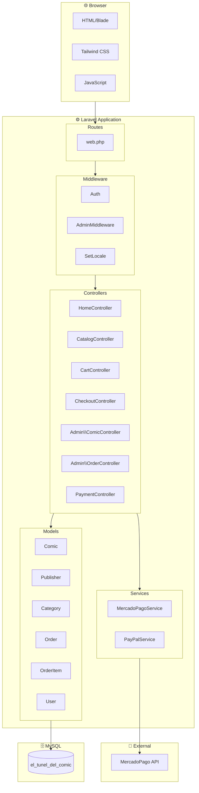

### Estructura de Directorios

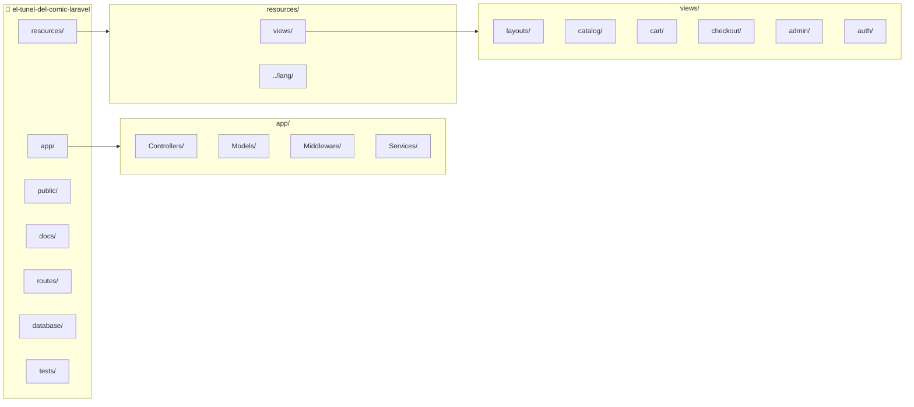

---

## Modelo de Base de Datos

### Diagrama Entidad-Relación

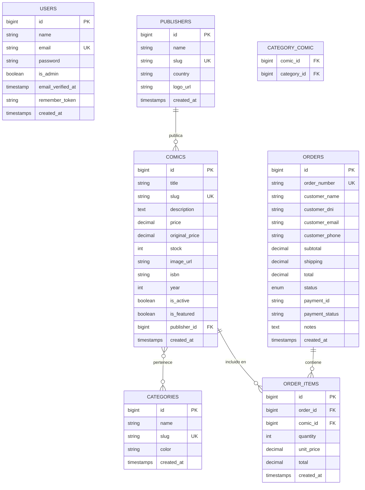

### Valores de Enumeración

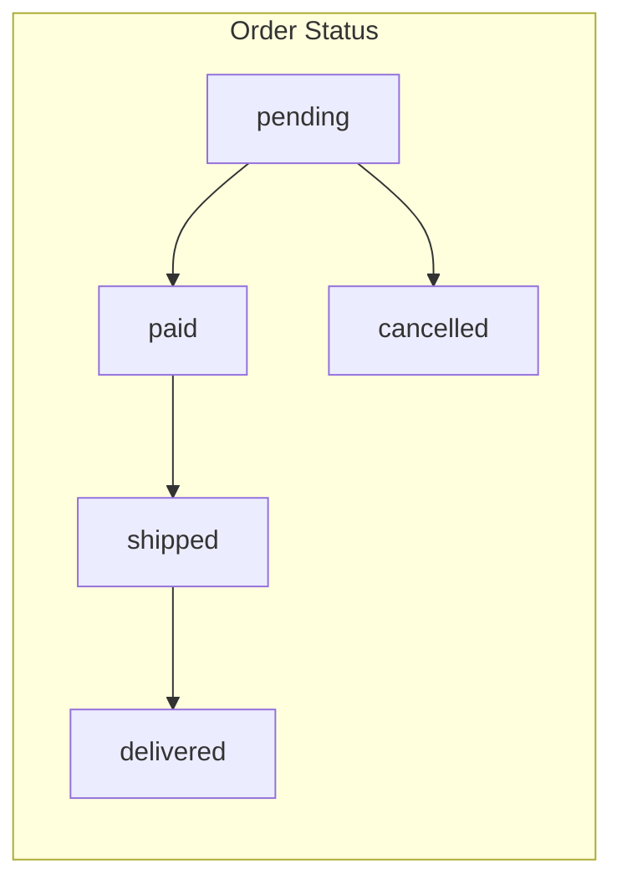

---

## Diseño Visual Original

El diseño original HTML tiene un estilo **industrial manga** con las siguientes características:

### Paleta de Colores

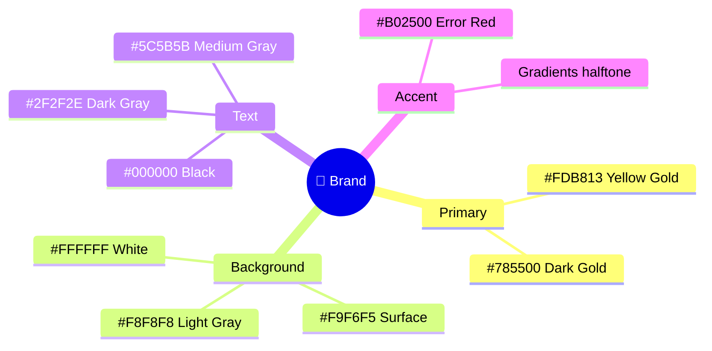

### Componentes Visuales del HTML Original

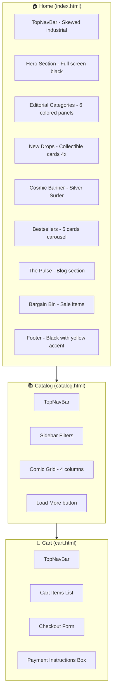

### Estilos Especiales

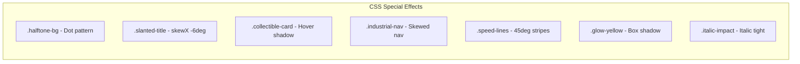

---

## Flujos de Usuario

### Flujo de Compra Completo

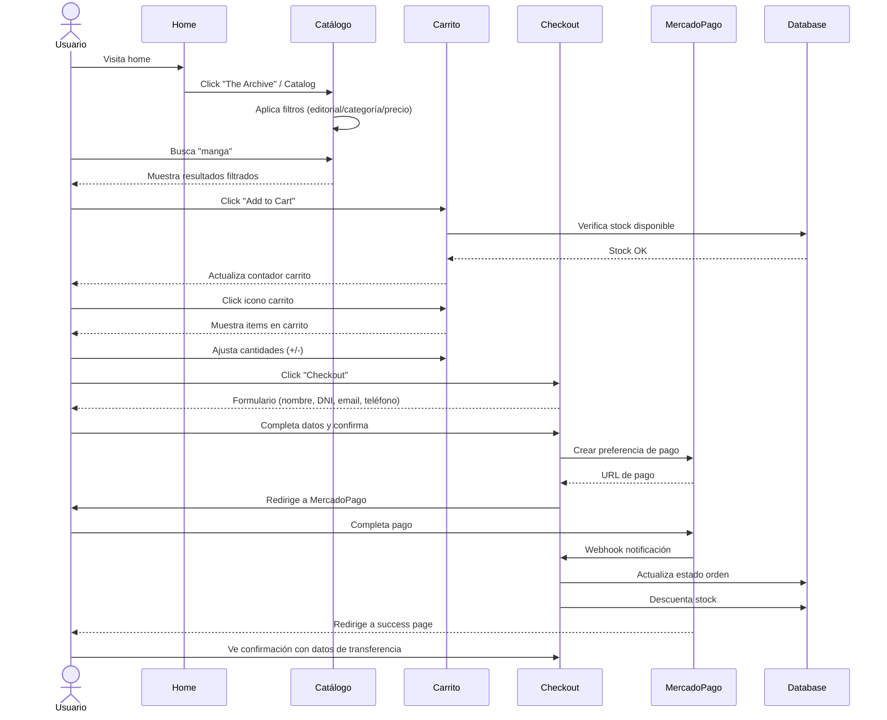

### Flujo de Administración

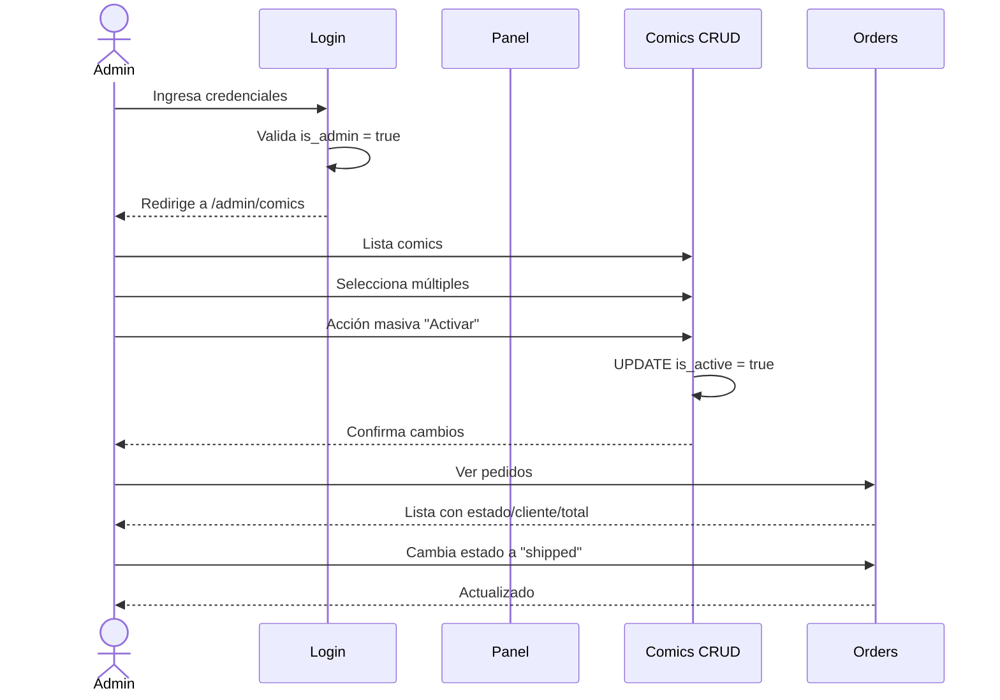

### Estados de Orden

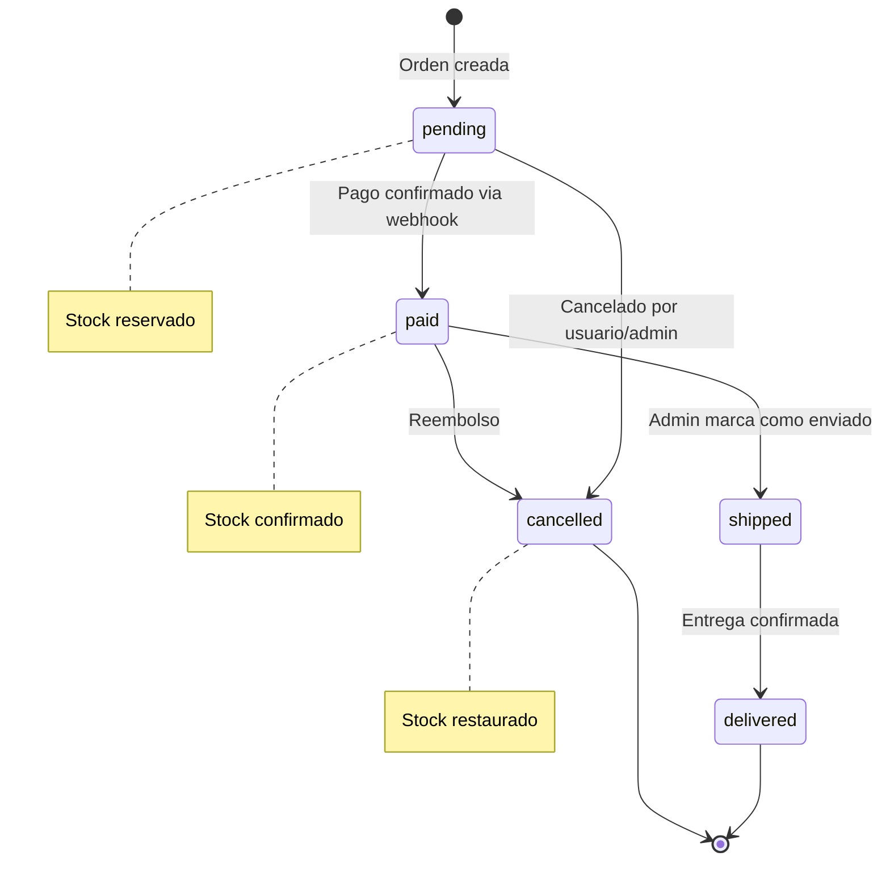

---

## API de Pagos

### Integración MercadoPago

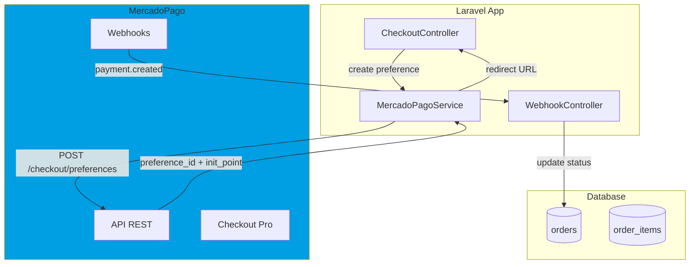

### Endpoints de Pago

| Endpoint | Método | Descripción |
|----------|--------|-------------|
| `/checkout` | GET | Formulario de checkout |
| `/checkout` | POST | Crear orden + preferencia MP |
| `/checkout/success` | GET | Página de éxito |
| `/checkout/failure` | GET | Página de error |
| `/checkout/pending` | GET | Pago pendiente |
| `/webhooks/mercadopago` | POST | Recibe notificaciones |

---

## Multilenguaje

### Idiomas Soportados

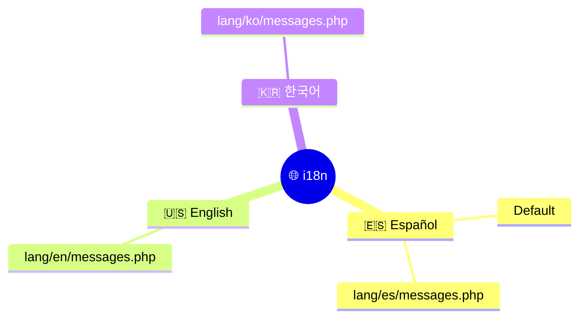

### Implementación

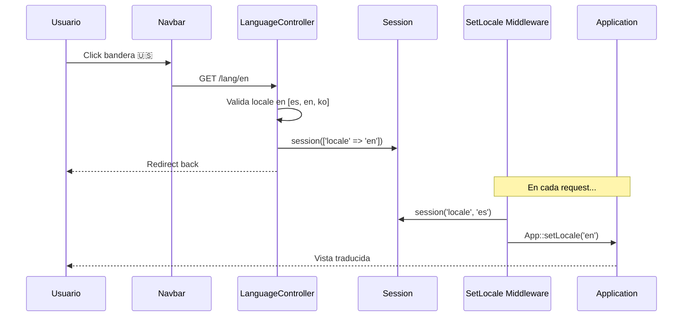

---

## Rutas

### Mapa de Rutas

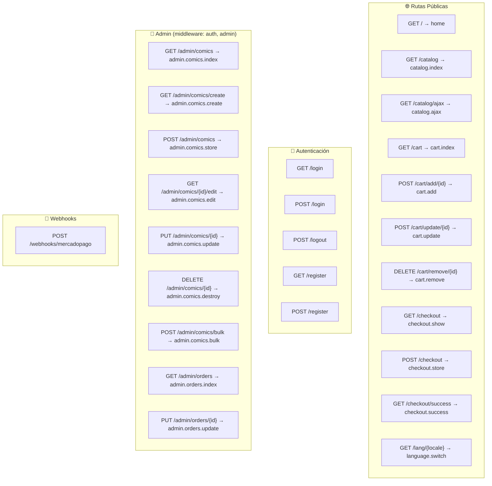

### Tabla de Rutas

| Método | URI | Acción | Middleware |
|--------|-----|--------|------------|
| GET | `/` | HomeController@index | web |
| GET | `/catalog` | CatalogController@index | web |
| GET | `/catalog/ajax` | CatalogController@ajax | web |
| GET | `/cart` | CartController@index | web |
| POST | `/cart/add/{comic}` | CartController@add | web |
| POST | `/cart/update/{comic}` | CartController@update | web |
| DELETE | `/cart/remove/{comic}` | CartController@remove | web |
| GET | `/checkout` | CheckoutController@show | web |
| POST | `/checkout` | CheckoutController@store | web |
| GET | `/checkout/success` | CheckoutController@success | web |
| GET | `/lang/{locale}` | LanguageController@switch | web |
| GET | `/login` | Auth | web, guest |
| POST | `/login` | Auth | web, guest |
| POST | `/logout` | Auth | web, auth |
| GET | `/admin/comics` | Admin\ComicController@index | web, auth, admin |
| POST | `/admin/comics/bulk` | Admin\ComicController@bulk | web, auth, admin |
| GET | `/admin/orders` | Admin\OrderController@index | web, auth, admin |
| POST | `/webhooks/mercadopago` | WebhookController@mercadopago | - |

---

## Instalación

### Requisitos

- PHP 8.2+
- Composer
- MySQL 8.0+
- Node.js (opcional, para assets)

### Pasos

```bash
# Clonar o navegar al proyecto
cd el-tunel-del-comic-laravel

# Instalar dependencias
composer install

# Configurar entorno
cp .env.example .env
php artisan key:generate

# Configurar base de datos en .env
# DB_DATABASE=el_tunel_del_comic
# DB_USERNAME=root
# DB_PASSWORD=Nienpedo01

# Ejecutar migraciones y seeders
php artisan migrate
php artisan db:seed

# Crear link simbólico para storage
php artisan storage:link

# Iniciar servidor
php artisan serve --port=8080
```

### Variables de Entorno para MercadoPago

```env
MERCADOPAGO_PUBLIC_KEY=APP_USR-xxxxxxxx
MERCADOPAGO_ACCESS_TOKEN=APP_USR-xxxxxxxx
MERCADOPAGO_WEBHOOK_SECRET=xxxxxxxx
```

---

## Testing

### Ejecutar Tests

```bash
# Todos los tests
php artisan test

# Con coverage
php artisan test --coverage

# Tests específicos
php artisan test --filter=ComicTest
php artisan test --filter=OrderTest
```

### Estructura de Tests

```
tests/
├── Feature/
│   ├── CatalogTest.php
│   ├── CartTest.php
│   ├── CheckoutTest.php
│   └── AdminTest.php
└── Unit/
    ├── ComicTest.php
    ├── OrderTest.php
    └── MercadoPagoServiceTest.php
```

---

## Datos de Pago (Transferencia Bancaria)

| Campo | Valor |
|-------|-------|
| Banco | Banco Galicia |
| CBU | 0000003100095847362514 |
| Alias | TUNEL.COMIC.PAY |
| Titular | EL TUNEL S.R.L. |
| Email | pagos@eltuneldelcomic.com |

---

## Soporte

📧 **Email:** soporte@eltuneldelcomic.com  
📞 **WhatsApp:** +54 9 11 0000-0000

---

*Documentación generada para El Túnel del Cómic - Laravel Edition*
